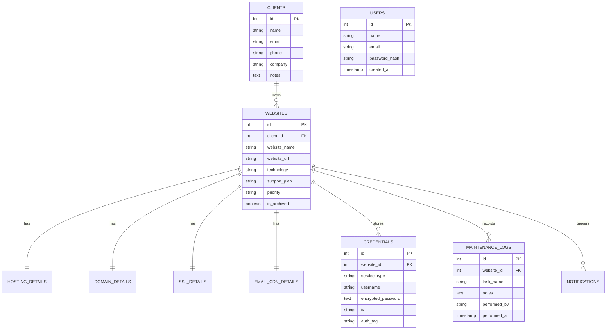

# WebWatch 360 — Website Maintenance & Expiry Tracker

[](https://nodejs.org/)
[](https://react.dev/)
[](https://www.mysql.com/)
[](https://tailwindcss.com/)
[](LICENSE)

> **WebWatch 360** is a centralized, single-user administrative dashboard built for developers, web agencies, and freelance consultants to track, monitor, and maintain their entire client website portfolio in one place. It automatically calculates service expiries (Domain, Hosting, SSL, Business Email, CDN), provides interactive maintenance checklists, dispatches proactive reminders, and securely stores login credentials inside an **AES-256-GCM** encrypted vault.

---

## 📑 Table of Contents
1. [The Problem & Objective](#-the-problem--objective)
2. [Key Features](#-key-features)
3. [Technology Stack](#-technology-stack)
4. [System Architecture](#-system-architecture)
5. [Quick Start (1-Click Launch)](#-quick-start-1-click-launch)
6. [Manual Installation & Setup](#-manual-installation--setup)
7. [Default Admin Credentials](#-default-admin-credentials)
8. [Database Schema](#-database-schema)
9. [API Endpoints Reference](#-api-endpoints-reference)
10. [Folder Structure](#-folder-structure)
11. [Testing & Verification Guide](#-testing--verification-guide)

---

## 🎯 The Problem & Objective

### The Problem
When a developer or agency manages dozens of client websites:
- **Scattered Information**: Client details, hosting cPanels, registrar logins, and expiry dates live across scattered notes, memory, spreadsheets, and buried emails.
- **Silent Expiries**: Domains drop, SSL certificates expire without warning (causing browser security blocks), and hosting bills bounce.
- **Unrecorded Maintenance**: Backups, plugin updates, security scans, and theme patches go unrecorded, making it difficult to prove value during billing audits.
- **Security Vulnerabilities**: Client passwords and server credentials get shared or stored in plain-text spreadsheets or chat messages.

### The Objective
WebWatch 360 provides a single, unified command centre:
- **Zero Missed Renewals**: Real-time expiry calculation with visual color badges.
- **One-Minute Portfolio Overview**: Total active sites, upcoming warnings, and overdue services at a glance.
- **Full Maintenance Audit Trail**: Every backup, security scan, and update is timestamped.
- **Encrypted Credentials Vault**: Hosting, CMS, and registrar credentials encrypted with **AES-256-GCM** at rest.

---

## 🚀 Key Features

### 1. Portfolio & Website Management
- **CRUD Operations**: Add, view, edit, and delete client websites.
- **Soft-Delete Archiving**: Archive inactive/seasonal websites without losing historical logs, and restore them anytime.
- **Multi-Faceted Search & Filters**: Search across website names, URLs, clients, and companies; filter by Technology (WordPress, Shopify, React, Laravel, etc.), Expiry Status, Priority, and Client.
- **Dual View Modes**: Switch seamlessly between compact Table View and modern Card Grid View.
- **Project Age Calculator**: Dynamically displays project longevity (e.g., *"1 year, 7 months old"*).

### 2. Real-Time Dynamic Renewal Tracking
Monitors 5 critical renewal types per website with real-time date math:
- 🌐 **Domain Expiry** (Registrar, expiry date, annual cost, auto-renew flag)
- 🖥️ **Hosting Renewal** (Provider, plan name, renewal date, cost, auto-renew)
- 🔒 **SSL Certificate Expiry** (Issuer, expiry date, SSL type, auto-renew)
- ✉️ **Business Email Expiry** (Provider, expiry date)
- ⚡ **CDN & Edge Security Expiry** (Provider, expiry date)

**Colour-Status Logic (Real-Time vs. Expiry Date):**
- 🟢 **Safe**: `> 30 days remaining` (Zero action needed)
- 🟡 **Expiring Soon**: `≤ 30 days remaining` (Renewal planning warning)
- 🔴 **Expired**: `Past expiry date` (Immediate overdue action with days counter)

### 3. Maintenance Checklist & Activity Logs
- **8-Point Routine Checklist**: Quick selection for Full Site Backup, Plugins/Themes Update, Malware Scan, Speed Optimization, Broken Links Fix, Database Optimization, Checkout Flow Verification, and SSL HTTPS Check.
- **Timestamped History**: Every logged task records performer name, developer notes, and timestamp.
- **Site-Specific & Global Filtering**: Filter maintenance records by target website.

### 4. Automated Notification Centre
- **Proactive Alerts Engine**: Dispatches notifications at **30, 15, 7 days**, and on the **expiry day itself**.
- **Live Navbar Bell**: Top navigation bell with live unread counter badge.
- **Notification Actions**: Mark as read, mark all read, delete, and manual **"Scan Expiries"** button.

### 5. Mandatory Credentials Vault (Section 3.5)
- **AES-256-GCM Encryption at Rest**: Encrypted using unique Initialization Vectors (IVs) and authentication tags. Passwords never appear in plain-text logs or database dumps.
- **Multi-Service Logins**: Store cPanel, WordPress Admin, FTP/SFTP, SSH Root, Database, and Registrar logins.
- **Developer UX**: Eye icon to reveal/hide decrypted password and 1-click **Copy to Clipboard** with toast feedback.

### 6. Reports & Data Export
- **Website Portfolio Export (CSV)**: Full spreadsheet with website URLs, clients, technologies, domain expiries, hosting costs, and SSL validity.
- **Maintenance Activity Logs (CSV)**: Export audit trail of all maintenance work.
- **Print-Ready Summary**: Formatted view for client reviews and monthly retainers.

---

## 🛠️ Technology Stack

| Layer | Technology | Details |
| :--- | :--- | :--- |
| **Frontend UI** | React 19 + Vite | High-performance component-driven SPA |
| **Styling** | Tailwind CSS 3.4 | Modern Slate & Indigo theme, responsive grid |
| **Icons** | Lucide React | Clean, scalable modern icons |
| **Backend API** | Node.js + Express | RESTful architecture with modular structure |
| **Database** | MySQL 8.0 | Relational database with connection pooling (`mysql2/promise`) |
| **Authentication** | JWT + bcryptjs | Token-based single-user admin authentication |
| **Encryption** | Node.js Crypto (`aes-256-gcm`) | Military-grade authenticated password encryption |

---

## ⚡ Quick Start (1-Click Launch)

### On Windows:
1. Ensure **MySQL Server** is running on your machine (default port `3306`).
2. Double-click **`start.bat`** in the root directory.
3. The script will automatically:
   - Check and stop any stale node processes on ports `5000` & `5173`.
   - Verify MySQL database connection and ensure tables exist.
   - Start the Backend API (`http://localhost:5000`).
   - Start the Frontend Dashboard (`http://localhost:5173`).
   - Open your default web browser to the login screen!

*(PowerShell users can right-click `start.ps1` -> Run with PowerShell)*

---

## 💻 Manual Installation & Setup

If you prefer to run the project manually via terminal:

### Step 1: Clone or Navigate to Directory
```bash
cd webwatch-360-project
```

### Step 2: Configure Environment Variables
Verify `backend/.env`:
```env
PORT=5000
NODE_ENV=development
DB_HOST=localhost
DB_PORT=3306
DB_NAME=webwatch360
DB_USER=root
DB_PASSWORD=your_mysql_password
JWT_SECRET=webwatch360_super_secret_jwt_key_2026_secure
JWT_EXPIRES_IN=7d
VAULT_SECRET_KEY=9f86d081884c7d659a2feaa0c55ad015a3bf4f1b2b0b822cd15d6c15b0f00a08
CORS_ORIGIN=http://localhost:5173
```

Verify `frontend/.env`:
```env
VITE_API_URL=http://localhost:5000/api
```

### Step 3: Run Database Migrations & Seeder
```bash
cd backend
npm install
npm run db:setup
```

### Step 4: Start Backend & Frontend
**Terminal 1 (Backend):**
```bash
cd backend
npm run dev
# Running on http://localhost:5000
```

**Terminal 2 (Frontend):**
```bash
cd frontend
npm install
npm run dev
# Running on http://localhost:5173
```

---

## 🔑 Default Admin Credentials

| Role | Email | Password | Quick Action |
| :--- | :--- | :--- | :--- |
| **Master Admin** | `admin@webwatch360.com` | `Admin@123456` | Click **"Auto-fill Demo Admin Credentials"** on login screen |

*(You can also click the **"Create Account"** tab on the login screen to register your own custom admin profile)*

---

## 🗄️ Database Schema



---

## 📡 API Endpoints Reference

### Authentication (`/api/auth`)
- `POST /api/auth/register` — Create new admin account
- `POST /api/auth/login` — Sign in and obtain JWT
- `GET /api/auth/me` — Retrieve active admin profile
- `POST /api/auth/change-password` — Update master password

### Websites (`/api/websites`)
- `GET /api/websites` — List websites (supports `search`, `technology`, `status`, `priority`, `client_id`, `is_archived`)
- `GET /api/websites/:id` — Get website details with computed 5-point renewal health
- `POST /api/websites` — Create website with relational hosting, domain, SSL, email & CDN
- `PUT /api/websites/:id` — Update website and relational services
- `PATCH /api/websites/:id/archive` — Soft-delete archive website
- `PATCH /api/websites/:id/restore` — Restore archived website
- `DELETE /api/websites/:id` — Permanent delete website

### Clients (`/api/clients`)
- `GET /api/clients` — List clients with active/archived website counts
- `POST /api/clients` — Create client
- `PUT /api/clients/:id` — Update client
- `DELETE /api/clients/:id` — Delete client

### Maintenance Logs (`/api/maintenance`)
- `GET /api/maintenance/logs` — List timestamped maintenance history (filter by `website_id`)
- `POST /api/maintenance/logs` — Record new checklist maintenance item
- `DELETE /api/maintenance/logs/:id` — Remove maintenance log

### Notifications (`/api/notifications`)
- `GET /api/notifications` — List alerts (supports `unread_only=true`)
- `POST /api/notifications/sync` — Scan all websites and generate 30/15/7/0 day alerts
- `PATCH /api/notifications/:id/read` — Mark single alert as read
- `PATCH /api/notifications/mark-all-read` — Mark all alerts as read
- `DELETE /api/notifications/:id` — Remove alert

### Credentials Vault (`/api/credentials`)
- `GET /api/credentials` — List vault credentials (decrypted for authenticated admin)
- `POST /api/credentials` — Save credential with AES-256-GCM encryption
- `PUT /api/credentials/:id` — Update credential
- `DELETE /api/credentials/:id` — Delete credential

### Reports & Dashboard (`/api/reports`, `/api/dashboard`)
- `GET /api/dashboard/summary` — Portfolio KPIs and critical alerts
- `GET /api/reports/summary` — Consolidated report data and monthly costs

---

## 📁 Folder Structure

```text
webwatch-360-project/
├── backend/
│   ├── src/
│   │   ├── config/             # Environment & constants
│   │   ├── database/           # MySQL pool, migrations & seeders
│   │   ├── middlewares/        # JWT auth, error handlers, validators
│   │   ├── modules/            # Auth, Websites, Clients, Maintenance,
│   │   │                       # Notifications, Credentials, Reports
│   │   ├── utils/              # Crypto (AES-256), ExpiryCalculator
│   │   ├── app.js              # Express app configuration
│   │   └── server.js           # Server entry point
│   ├── .env                    # Backend environment config
│   └── package.json
│
├── frontend/
│   ├── src/
│   │   ├── components/         # Layout, Navbar, Sidebar, Badges, Modals
│   │   ├── context/            # AuthContext, ToastContext
│   │   ├── pages/              # Dashboard, Websites, Details, Clients,
│   │   │                       # Maintenance, Vault, Notifications, Reports
│   │   ├── services/           # Axios API connectors
│   │   ├── utils/              # Real-time statusColor & date helpers
│   │   ├── App.jsx             # React router & protected routes
│   │   └── index.css           # Tailwind CSS components & theme
│   ├── .env                    # Frontend environment config
│   └── package.json
│
├── start.bat                   # 1-Click Windows Batch Launcher
├── start.ps1                   # 1-Click PowerShell Launcher
├── PROJECT_REPORT.md           # Formal Internship Technical Report
├── README.md                   # Full Project Documentation
└── .gitignore                  # Git ignore rules
```

---

## 📄 License
This project is developed as part of the GWS Digital Services 6-Week Internship program and is open-source under the [MIT License](LICENSE).
